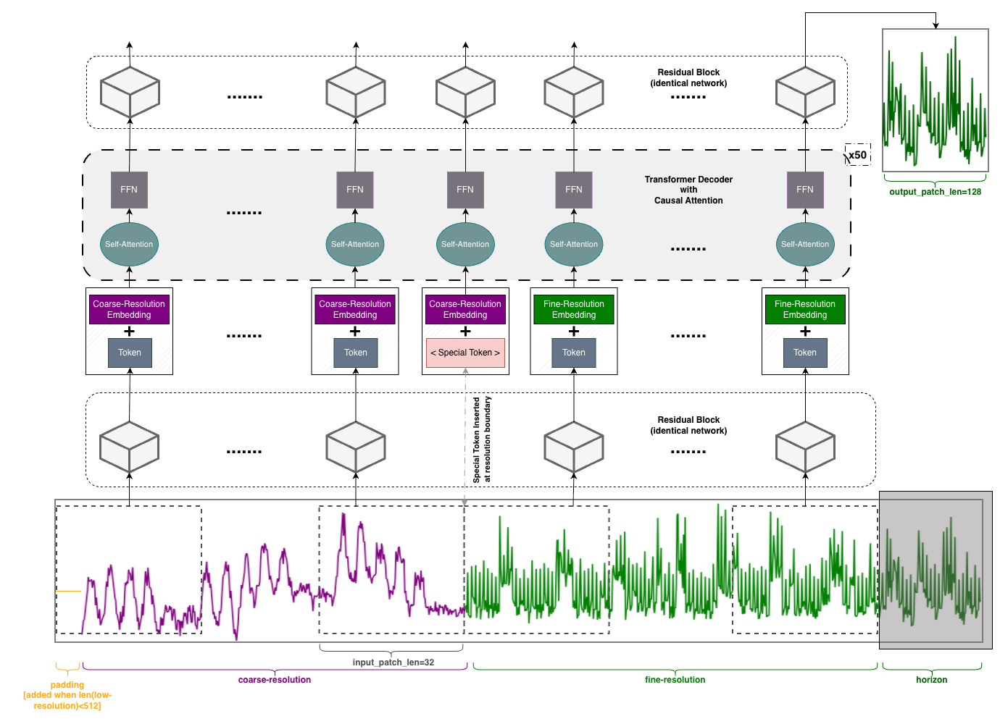
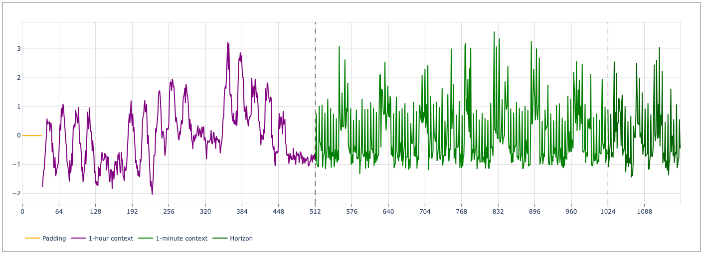

# Cisco Time Series Model

[](https://arxiv.org/abs/2511.19841)
[](https://huggingface.co/cisco-ai/cisco-time-series-model-1.0-preview)
[](https://opensource.org/licenses/Apache-2.0)

The Cisco Time Series Model is a foundation model trained to perform univariate zero-shot forecasting. Its core is a sequence of decoder-only transformer layers. It is based on the [TimesFM2.0 model](https://huggingface.co/google/timesfm-2.0-500m-pytorch), with multiresolution modifications aimed at efficient use of long context. It expects a multiresolution context ($x_c$, $x_f$), where the resolution (i.e., space between data points) of $x_c$ is 60 times the resolution of $x_f$. Both $x_c$ and $x_f$ can have length up to 512. The input contexts should be aligned “on the right,” e.g., if $x_f$ consists of the 512 minutes terminating at 11:00AM on November 11, then $x_c$ should consist of the 512 hours terminating at the same time. The output is a forecast of 128 points, which should be interpreted at the finer resolution; and corresponding quantiles for these points.

For convenience, we also provide utilities for preparing a multiresolution context from a single resolution context (with length up to 512 x 60 = 30,720) directly.

## Model Architecture and Training Details
<figure>
  
  <figcaption><em>Architecture diagram illustrating our novel additions of Resolution Embeddings and Special Token.</em></figcaption>
</figure>

Despite not conforming to the TimesFM architecture, the pre-training of the Cisco Time Series Model began from the weights of TimesFM. The dataset used for the additional training contains over 300B unique datapoints. Slightly more than 50% of the data is derived from metric time series data from internal deployments of the Splunk Observability Cloud, with about 35% at (1-hour, 1-minute) resolution, and the remaining 15% at (5-hour, 5-minute) resolution. Additional multiresolution data, comprising about 30% of the training set, was derived from the [GIFT-Eval](https://huggingface.co/datasets/Salesforce/GiftEvalPretrain) pretraining corpus. Another 5% was derived from the [Chronos](https://huggingface.co/datasets/autogluon/chronos_datasets) dataset collection (less overlap with GIFT-Eval test). The final 15% is synthetic multiresolution data.

The technical report is now available on [arXiv](https://arxiv.org/abs/2511.19841); you can also access a local copy [here](1.0-preview/technical_report/Cisco-Time-Series-Model-Technical-Report.pdf).

### Example Visualization of Multiresolution Time Series Input to the Model
<figure>
  
  <figcaption><em>Multiresolution time series example with padded 1-hour context.</em></figcaption>
</figure>


## Usage notes
- If the input time series is missing some values, imputation via last value is recommended; if the time series is naturally sparse and this leads to excessive imputation (e.g., more than 30% of values are imputed), the model forecasts will deteriorate.
- The model generally works better when more coarse resolution history is provided. Its performance may suffer on very short inputs.
- The quantiles have not been calibrated or rigorously evaluated, e.g., we currently do not have evidence to support a claim along the lines of “the range from q=0.1 to q=0.9 contains the true value 80% of the time (under some mild conditions).”

## Dependencies and Installation

1.  Clone the repository:
    ```shell
    git clone https://github.com/splunk/cisco-time-series-model.git
    cd cisco-time-series-model
    ```

2.  Create a virtual environment and install dependencies using `uv`:
    ```shell
    # Install uv if required
    curl -LsSf https://astral.sh/uv/install.sh | sh

    # Create a virtual environment
    uv venv
    
    # Activate the environment
    source .venv/bin/activate
    
    # Install the package in editable mode with torch
    uv pip install -r requirements.txt
    ```

3. [Optional] Install your preferred `torch` backend based on your OS and accelerators (CPU, GPU, TPU or Apple Silicon).:
    - [Install PyTorch](https://pytorch.org/get-started/locally/).

4. Change directory to modeling code:
    ```shell
    cd 1.0-preview/
    ```

## Example Code

```python
import torch
import numpy as np
from modeling import CiscoTsmMR, TimesFmHparams, TimesFmCheckpoint

rng = np.random.default_rng(42)

## Sample data
T = 512 * 60
hours = (T + 59) // 60
k = np.arange(hours, dtype=np.float32)
h = (80 + 0.1 * k) * (1 + 0.25 * np.sin(2 * np.pi * k / 24))
t = np.arange(T, dtype=np.float32)

input_series_1 = h[(t // 60).astype(int)] * (1 + 0.05 * np.sin(2 * np.pi * t / 30)) + rng.normal(0, 0.4, size=T)

# Hyperparameters
hparams = TimesFmHparams(
    num_layers=50,
    use_positional_embedding=False,
    backend="gpu" if torch.cuda.is_available() else "cpu",
)

ckpt = TimesFmCheckpoint(huggingface_repo_id="cisco-ai/cisco-time-series-model-1.0-preview")

model = CiscoTsmMR(
    hparams=hparams,
    checkpoint=ckpt,
    use_resolution_embeddings=True,
    use_special_token=True,
)

# Model Inference
forecast_preds = model.forecast(input_series_1, horizon_len=128)

# Access forecast mean and quantiles of each series
mean_forecast = forecast_preds[0]['mean'] # (128,)
quantiles = forecast_preds[0]['quantiles'] # dict with keys as quantile levels (0.1, 0.2, ...., 0.9) and values as (128,) numpy arrays

# You can also forecast multiple series at once
T = 25_000
hours = (T + 59) // 60
k = np.arange(hours, dtype=np.float32)
h = 120 / (1 + np.exp(-0.01 * (k - 300))) + 10 * np.cos(2 * np.pi * k / (24*7))
t = np.arange(T, dtype=np.float32)
input_series_2 = h[(t // 60).astype(int)] + 2 * np.sin(2 * np.pi * t / 60) + rng.normal(0, 0.5, size=T)

multi_series_forecasts = model.forecast([input_series_1, input_series_2], horizon_len=128)

# Long horizon forecasting is also supported and can be invoked as follows
long_horizon_forecasts = model.forecast(input_series_1, horizon_len=240)

```

## Example Notebooks
We also provide few Jupyter notebooks demonstrating how to use the Cisco Time Series Model for forecasting real-world time series data:
- [CPU Utilization Forecasting](1.0-preview/notebooks/cpu_utilization_forecast.ipynb)
- [Alerting Server Response Time Forecasting](1.0-preview/notebooks/alerting_server_responsetime.ipynb)
- [Internet Traffic Forecasting](1.0-preview/notebooks/internet_traffic_forecast.ipynb)

<b>Notebooks contributed by:</b> Huaibo Zhao

## Citation
If you find Cisco Time Series Model useful for your research, please consider citing the associated technical report:
```
@misc{gou2025ciscotimeseriesmodel,
      title={Cisco Time Series Model Technical Report}, 
      author={Liang Gou and Archit Khare and Praneet Pabolu and Prachi Patel and Joseph Ross and Hercy Shen and Yuhan and Song and Jingze Sun and Kristal Curtis and Vedant Dharnidharka and Abhinav Mathur and Hao Yang},
      year={2025},
      eprint={2511.19841},
      archivePrefix={arXiv},
      primaryClass={cs.LG},
      url={https://arxiv.org/abs/2511.19841}, 
}
```

## Authored by:
- Liang Gou \*
- Archit Khare \*
- Praneet Pabolu \*
- Prachi Patel \*
- Joseph Ross \*
- Hercy Shen \*‡
- Yuhan (Ellen) Song \*
- Jingze Sun \*
- Kristal Curtis †
- Vedant Dharnidharka †
- Abhinav Mathur †
- Hao Yang †

\* These authors contributed equally to the core development of this work, listed alphabetically by last name. <br>
† These authors contributed equally to supporting and extending this work, listed alphabetically by last name. <br>
‡ Hercy Shen contributed to this work while an intern at Splunk.<br>

## License
This project is licensed under the Apache-2.0 License. See the [LICENSE](LICENSE) file for more details.
